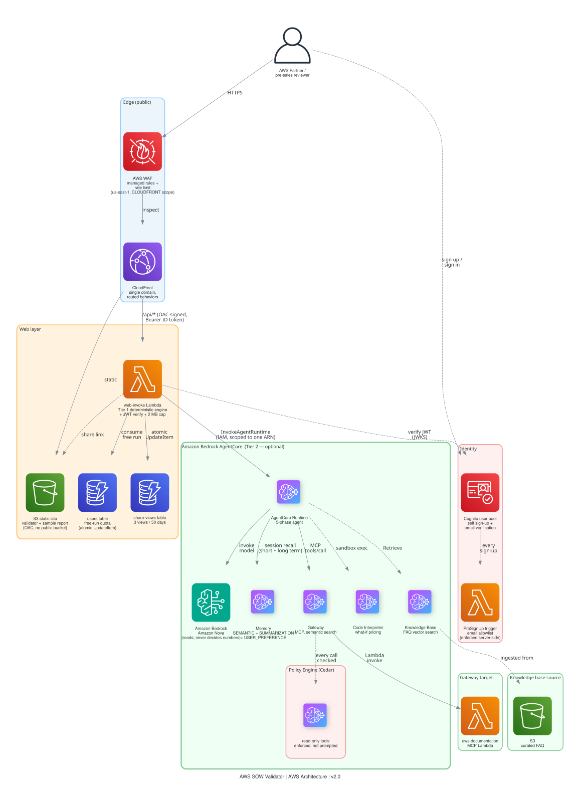

# AWS SOW Validator

> [!IMPORTANT]
> The examples provided in this repository are for experimental and educational purposes only. They demonstrate concepts and techniques but are not intended for direct use in production environments. Make sure to have Amazon Bedrock Guardrails in place to protect against [prompt injection](https://docs.aws.amazon.com/bedrock/latest/userguide/prompt-injection.html).

Reviews an AWS Scope of Work and its proposed architecture against segment and industry
rules, checks that the services actually connect, prices it, scores the SOW, and recommends
further reading from AWS sources only — behind a public web front end where a partner or
pre-sales reviewer uploads a document and gets a structured report back, without touching a
terminal.

**The design rule: the model reads, Python decides.** Amazon Nova handles language
understanding — extracting services from a document, banding vague SOW prose onto a rubric.
Every number, every integration verdict, and every citation URL is computed by deterministic
Python against versioned YAML rule packs. Three runs of the identical SOW against this rule
pack produced identical findings, identical integration verdicts, and the identical cost
total — $427.64, every time — because none of those pass through a model. The one figure
that moved was the model-assisted SOW score (75.0, 73.8, 72.5 across the three runs): Amazon
Nova bands SOW prose onto the scoring rubric, and that banding step is not deterministic.
Treat the score as advisory, not a reproducible number — everything else the tool reports
is.

Built for partner and pre-sales teams who need a consistent first-pass review of a
proof-of-concept before it reaches a customer.

| | |
|---|---|
| ⏱️ **Time to deploy** | ~15-20 min for the agent (AgentCore CLI + Cognito); +~10 min for the optional web layer |
| 💰 **Running cost** | ~$0.02–0.08 per review (Runtime + Bedrock, per-invocation billing); idle cost near zero |
| 🏗️ **Resources created** | Agent: Runtime, Memory, Gateway (+1 Lambda target), Identity credential, Policy Engine (via `agentcore deploy`). Web layer (optional): CloudFront, S3, 1 Lambda, 1 DynamoDB table |
| 🧹 **Teardown** | `./scripts/teardown_all.sh <region>` — dry run by default, one command for everything |

No AWS account needed to try the deterministic engine — jump to
[Quickstart](#quickstart--no-aws-account-needed) below, or read the
[technical write-up](docs/BLOG.md) first.

## Overview

### Use case details

| Information | Details |
|---|---|
| Use case type | Event-driven / document review (single-shot, not conversational) |
| Agent type | Single agent, five deterministic-and-model phases |
| Use case components | Runtime + Amazon Nova (every review); Tools (Gateway/Lambda MCP target), Memory, Identity (M2M OAuth), Policy Engine (Cedar) — provisioned and reachable, exercised only on the optional tool-calling/what-if/FAQ paths, see [Use case key features](#use-case-key-features) below; Evaluations (configured, account-dependent — see Known Limitations), Observability, IaC (CDK), optional public web front end with view-limited share links |
| Use case vertical | Cross-industry — partner/pre-sales architecture review (segment + industry rule packs cover Enterprise/SMB/Digital Native × FSI/Retail/Generic out of the box) |
| Example complexity | Intermediate |
| SDK used | Amazon Bedrock AgentCore SDK (Strands), AgentCore CLI (`agentcore.json`), AWS CDK (web layer + supplementary infra), boto3 |

### What you'll learn

| Concept | What it demonstrates |
|---------|---------------------|
| **Model where judgement is needed, code where it isn't** | Phases 2, 3 and 5 (validation, pricing, recommendations) are plain deterministic Python — the model never computes a number a reviewer would take at face value. Only diagram reading (vision) and SOW prose banding go through the model. See [ADR 0003](docs/decisions/0003-deterministic-validation-pricing-and-scoring.md). |
| **Human confirmation gate on vision extraction** | A diagram *image* is the one place a misread genuinely misleads a reviewer, so nothing downstream runs until the extraction is confirmed. Diagram *source* (Mermaid/draw.io) parses exactly and skips the gate entirely. See [ADR 0002](docs/decisions/0002-human-confirmation-gate-on-diagram-extraction.md) and [ADR 0007](docs/decisions/0007-deterministic-diagram-sources-over-vision.md). |
| **Unverified beats invented** | A service pair absent from the integration catalogue is reported as *unverified*, never silently approved or silently guessed. |
| **Code-enforced allowlist, not a prompt instruction** | Every recommendation URL is checked against an AWS-domain allowlist in `core/resources.py` at load time — a test asserts the rejection list is empty, so a bad URL fails CI, not a demo. See [ADR 0004](docs/decisions/0004-code-enforced-domain-allowlist.md). |
| **Graceful degradation, not hard failure** | If a model call fails (quota, access, transient error), SOW scoring falls back to its deterministic heuristic floor and says so in the output, rather than crashing the whole review. |
| **AgentCore Identity for M2M auth** | `@requires_access_token(auth_flow="M2M")` manages the Gateway's OAuth token via the Identity vault — no client secret in an env var. |
| **Cedar policy enforcement** | The Gateway's Policy Engine runs in `ENFORCE` mode: read-only tool access is a platform constraint, not a prompt request. |
| **A public, view-limited share link for a private agent** | The optional web layer lets an unauthenticated visitor view *one specific* result via a link — capped at 3 views and 30 days by an atomic DynamoDB counter — without exposing the agent itself or any other result. |

### Use case architecture



<sub>SVG scales cleanly at any zoom level. If your viewer doesn't render inline SVG, see
[architecture.png](./assets/architecture.png) instead.</sub>

<details>
<summary>Text description (for accessibility)</summary>

**Agent core (always deployed):** AgentCore Runtime runs a 5-phase entrypoint (diagram
intake → validation → pricing → SOW scoring → recommendations) against Amazon Nova — the
only two components a standard review actually invokes, confirmed against CloudWatch logs
from real production runs. AgentCore Memory (cross-session recall), Gateway (MCP, semantic
search, CUSTOM_JWT via a Cognito M2M client, reaching one Lambda-backed AWS Documentation
MCP target), Identity (mints the Gateway's OAuth token), and Policy Engine (Cedar,
`ENFORCE` mode on every Gateway tool call) are all provisioned and reachable — the
response's `gateway_available: true` means reachable, not called — but a standard
diagram-and-SOW review generates zero calls to any of them. They engage only on the
optional paths: an explicit what-if pricing question, an explicit FAQ query, or a caller
that supplies a stable identity across sessions.

**Web layer (optional):** A browser talks HTTPS to one CloudFront distribution. A
CloudFront Function does Basic Auth at the edge. The default and `/share/*` behaviors
serve a static page from S3 (the upload form and the read-only share-result shell);
`/api/invoke` and `/share/*.json` route — via CloudFront Origin Access Control, so the
Lambda has no public URL of its own — to a Lambda that either runs the agent
(`InvokeAgentRuntime`, IAM-scoped to one runtime ARN) or serves a previously-completed
result after an atomic DynamoDB conditional `UpdateItem` confirms the 3-view cap hasn't
been hit.

</details>

Full component and data-flow detail: [docs/ARCHITECTURE.md](docs/ARCHITECTURE.md).
Regenerate the diagram with `python3 diagrams.py` (`brew install graphviz && pip install diagrams`).

### Use case key features

- **Five-phase pipeline** — diagram intake (deterministic source parse, or vision with a
  human confirmation gate), validation, pricing, SOW scoring, recommendations.
- **Segment- and industry-aware rules** — the same architecture is judged differently for
  a startup vs. a bank; rules are YAML, not code, so adding a segment or industry is a new
  file, not a new deploy.
- **Integration chaining classifier** — every edge in the diagram is labelled native,
  glue-required, anti-pattern, or unverified. Nothing is asserted that isn't in the
  catalogue.
- **AWS-only recommendations, enforced in code** — not a prompt instruction.
- **Runs with zero AWS account** — the deterministic core (`core/`) and a CLI
  (`scripts/local_review.py`) work entirely offline; see Quickstart below.
- **Optional public front end with expiring, view-limited share links** — upload a SOW,
  get a result, hand someone a link that works 3 times over 30 days without giving them
  your login.
- **Optional what-if pricing, evaluated in Code Interpreter** — a plain-language cost
  question (for example, "what if we used Reserved Instances") is answered by executing
  model-authored code in AgentCore's managed sandbox against the actual cost line items.
  The response includes the executed code, so the result is auditable rather than a figure
  the model stated directly. See [ADR 0010](docs/decisions/0010-code-interpreter-for-what-if-pricing.md).
- **Optional shared FAQ search, backed by a Knowledge Base** — recurring findings (HIPAA
  and VPC placement, RDS storage class, Multi-AZ, WAF, and others) are grounded in a
  curated Knowledge Base rather than model memory, and retrieved with vector search only —
  no generation call. See [ADR 0011](docs/decisions/0011-shared-faq-knowledge-base-not-per-actor-memory.md).

## Prerequisites

**Deterministic core (no AWS account):**
- Python 3.10+
- `pip install PyYAML`

**Deploying the agent:**
- AWS Account with [Bedrock model access](https://docs.aws.amazon.com/bedrock/latest/userguide/model-access.html) for whichever model you configure via `AGENT_MODEL_ID`/`FAST_MODEL_ID` — the hosted instance runs Amazon Nova Pro (`amazon.nova-pro-v1:0`) for both diagram vision and SOW grading; the code defaults to Claude Sonnet/Haiku instead. See [docs/BLOG.md](docs/BLOG.md#where-amazon-nova-fits-and-why) for why Nova fits this workload.
- [AgentCore CLI](https://docs.aws.amazon.com/bedrock/latest/userguide/agentcore.html) (`npm install -g @aws/agentcore`, ≥ 0.26.0)
- [AWS CDK CLI](https://docs.aws.amazon.com/cdk/v2/guide/getting-started.html) (`npm install -g aws-cdk`) — used internally by `agentcore deploy`
- [Docker](https://www.docker.com/products/docker-desktop/) or [Finch](https://github.com/runfinch/finch) (container runtime, for the Runtime image build)
- [AWS CLI v2](https://docs.aws.amazon.com/cli/latest/userguide/getting-started-install.html) configured (`aws configure`)
- Node.js 18+

**Optional web layer (upload UI + shareable results):**
- Everything above, plus `pip install boto3` for the Lambda package and an existing CloudFront/S3 setup, or use `infrastructure/cdk/` to provision one — see [infrastructure/cdk/README.md](infrastructure/cdk/README.md)

## Use case setup

### Quickstart — no AWS account needed

The deterministic core runs entirely offline. Start here before deploying anything.

```bash
pip install PyYAML
python scripts/local_review.py --list
python scripts/local_review.py --example fsi_loan --sow config/data/samples/sample-sow-weak.md
```

Then the UI:

```bash
python -m venv .venv-ui && source .venv-ui/bin/activate
pip install -r source/ui/requirements.txt
streamlit run source/ui/app.py
```

Load an example from the sidebar and press **Validate submission**. Try
`Deliberately broken` to see what happens when a submission asserts integrations that do
not exist.

> **The UI and the agent cannot share a virtualenv.** `bedrock-agentcore` requires
> `starlette >= 1.6` and `websockets >= 17`; `streamlit` requires `starlette < 1.4` and
> `websockets < 17`. Install them separately. See
> [ADR 0005](docs/decisions/0005-separate-ui-and-agent-dependencies.md).

### Deploying the agent to your AWS account

Adds diagram extraction, model-assisted SOW grading, cross-session memory and
documentation grounding through the Gateway.

```bash
cp infrastructure/agentcore/aws-targets.json.template infrastructure/agentcore/aws-targets.json
# fill in your account id and region

./scripts/setup_cognito.sh us-east-1   # User Pool + M2M client for the Gateway
cd infrastructure/agentcore
agentcore validate                     # verified Valid against @aws/agentcore 0.26.0
agentcore dev                          # local development server, hot reload
cd ../..
./deploy.sh dev                        # Runtime, Memory, Gateway, Policy Engine
cd infrastructure/agentcore && agentcore logs && agentcore traces list
```

Point the UI at the deployed Runtime by pasting the ARN into the sidebar, or exporting
`AGENTCORE_RUNTIME_ARN`.

### Deploy the web layer (one command)

The web layer is the product: a public page, sign-up with email verification, the
deterministic Tier-1 engine, and AWS WAF in front of it. It needs **no Bedrock access and no
container build** — the Amazon Nova agent path is opt-in.

```bash
cd infrastructure/cdk
npm ci
npx cdk deploy PocValidatorWebStack
```

Every CDK context value is optional; a bare deploy produces a working public instance.
`PocValidatorWafStack` deploys first automatically — CDK follows the cross-stack dependency.

To add the Amazon Nova agent path, pass the AgentCore runtime ARN:

```bash
npx cdk deploy PocValidatorWebStack -c agentRuntimeArn=<your-runtime-arn>
```

Without it the stack still deploys and the UI hides the agent action.

#### Configuration

| Context value | Default | Purpose |
|---|---|---|
| `agentRuntimeArn` | *(unset)* | Enables the Amazon Nova agent path |
| `signupAllowed` | `amazon.com,schinchli@gmail.com` | Email allowlist. An entry with `@` is an exact address; without `@` it is an exact domain match. Set to `""` to allow anyone. |
| `freeRuns` | `1` | Free agent reviews per verified user |
| `selfHostUrl` | *(unset)* | Repository URL shown when a user hits the quota |

Sign-up is enforced by a Cognito PreSignUp Lambda trigger, not by the browser — a client-side
check would be bypassed by calling the Cognito API directly. Domain matching uses
`rpartition("@")`, so `amazon.com.evil.com` is correctly rejected.

### Deploying to a region other than us-east-1

The stack is region-portable, with one constraint worth knowing: **AWS WAF for CloudFront must
be created in us-east-1**, whatever region the rest of the stack lives in. That is handled by a
separate `PocValidatorWafStack` pinned to us-east-1 and consumed via `crossRegionReferences`,
so it stays a single command.

```bash
AWS_REGION=eu-west-1 npx cdk deploy PocValidatorWebStack
```

Note `CDK_DEFAULT_REGION` will not work here — the CDK CLI sets that itself from your profile,
overriding anything you export. Use `AWS_REGION`.

Bedrock AgentCore and Amazon Nova Pro are both confirmed available (by direct API probe) in
`us-east-1`, `us-west-2`, `ap-south-1`, `ap-southeast-2`, `eu-central-1`, `eu-west-1`, and
`ap-northeast-1` — pick any of those for `AWS_REGION` when deploying the agent path.

## Execution instructions

```bash
python -m pytest tests/ -q
```

202 Python tests, under three seconds, no network, plus 34 CDK construct tests (`npm test`
in `infrastructure/agentcore/cdk/` and `infrastructure/cdk/`) — see [Tests](#tests) below for what they cover.

To exercise the deployed agent directly:

```bash
agentcore invoke '{"sow_text": "...", "diagram_text": "...", "segment": "enterprise", "industry": "fsi"}'
```

Add `what_if_question` and/or `faq_query` to the same payload to also run Phase 6a/6b
(both optional — see [ADR 0010](docs/decisions/0010-code-interpreter-for-what-if-pricing.md)
and [ADR 0011](docs/decisions/0011-shared-faq-knowledge-base-not-per-actor-memory.md)):

```bash
agentcore invoke '{
  "sow_text": "...", "diagram_text": "...", "segment": "enterprise", "industry": "fsi",
  "what_if_question": "What if we removed Multi-AZ from the database?",
  "faq_query": "Why does production RDS need Multi-AZ?"
}'
```

Each shows up as its own block in the result (`result.what_if`, `result.faq`), with a
`status` of `ok` or `unavailable` — never a hard failure of the rest of the review.

Or, with the web layer deployed, open the CloudFront URL, upload a Scope of Work
(`.txt`/`.md`) and optionally a diagram (`.mmd`/`.drawio`), and press **Run validation**.

## Clean up instructions

One command per region, dry run by default:

```bash
./scripts/teardown_all.sh us-east-1              # list what would be deleted
./scripts/teardown_all.sh us-east-1 --confirm    # delete, after typing the region back
```

It removes the web stack, the agent stack, and the separate us-east-1 WAF stack, then lists
the S3 buckets and ECR repositories that CloudFormation retains when non-empty — the usual
reason a "deleted" stack keeps costing money — with the commands to remove those too.

### Indicative cost

Idle cost is near zero — Runtime and Gateway bill per invocation. A review costs roughly
$0.02–0.08 depending on whether a diagram and a SOW are supplied. Memory storage and
CloudWatch logs are the only standing charges, both cents per month at sample volumes. The
optional web layer adds a Lambda (\<1M free-tier requests/month), a DynamoDB table
(on-demand, pennies at this scale), and CloudFront/S3 (fractions of a cent per review
viewed). Build your own detailed estimate at the
[AWS Pricing Calculator](https://calculator.aws/#/estimate) — see
[docs/ARCHITECTURE.md](docs/ARCHITECTURE.md#cost) for the per-service breakdown this
sample's numbers are based on.

## Design decisions worth knowing

**The model never computes anything a reviewer would take at face value.** Findings, cost
arithmetic and the SOW total are deterministic Python. The model reads diagrams and bands
prose — tasks that need judgement — and nothing else. Phases 2, 3 and 5 involve no model
at all. This follows the same reasoning as ADR 0014 in the
event-driven-claims-agent sample in [awslabs/agentcore-samples](https://github.com/awslabs/agentcore-samples).

**Unknown integrations are reported, never guessed.** A service pair absent from
`config/data/integrations.yaml` is labelled *unverified* and raised as a finding asking the
reviewer to confirm it. Silence never reads as approval.

**Diagram extraction is gated on human confirmation.** Vision extraction from
architecture diagrams is the weakest link in the pipeline. Findings generated against a
misread diagram would describe a design the partner never proposed, so nothing runs until
the extraction is confirmed. Unrecognised boxes are shown to the user rather than dropped.

**The AWS-only restriction is enforced in code.** `core/resources.py` checks every URL
against a domain allowlist at load time. It is not a prompt instruction, because a prompt
instruction is a request: a model told to "only cite AWS sources" will eventually cite a
Medium post, and nobody will notice until it is in front of a customer. A test asserts the
rejection list is empty, so a bad URL fails CI.

**Conflicts are surfaced, not resolved silently.** When a cost-sensitive segment meets a
regulatory floor — Digital Native plus FSI — the stricter rule wins and the tension is
shown, with the cost impact itemised separately.

**Prefer a diagram source over a diagram image.** draw.io and Mermaid files parse exactly.
Vision is the fallback, not the default — see
[ADR 0007](docs/decisions/0007-deterministic-diagram-sources-over-vision.md).

**Rules are data.** Adding an industry is one YAML file in `config/rules/industries/`. Adding a
service is one entry in `config/data/services.yaml`. Adding a recommendation is one entry in
`config/data/resources.yaml`. No code changes, and the test suite validates every entry against
the attribute registry so a typo fails fast rather than silently never firing.

**A public share link is view-limited by a real conditional write, not client trust.**
`/share/*.json` goes through the Lambda, not straight to S3, specifically so the 3-view
cap is enforced server-side (`ConditionExpression: attribute_exists(share_id) AND
view_count < :max` on a DynamoDB `UpdateItem`) — a client can't just refetch the S3 object
directly to bypass it, because the bucket policy only grants CloudFront's own OAC
principal read access.

## Layout

```
assets/                   architecture.svg, architecture.png, icons/ (diagrams.py output)
config/
  data/                   services, integrations, pricing, resources, examples, samples
  rules/                  segment packs, industry packs, SOW criteria
infrastructure/
  agentcore/
    agentcore.json.template   Runtime, Memory, Gateway, Identity, Policy, Evaluators
    mcp-targets/aws-documentation/   Lambda-backed AWS Documentation MCP Gateway target
    cdk/                      Generic CDK synthesis app the agentcore CLI drives
  cdk/                        CDK for the web layer (Lambda, DynamoDB, CloudFront routing)
source/
  agent/                  AgentCore agent + deterministic core
    main.py               AgentCore Runtime entrypoint — five phases
    config.py              ALL env var reads (mirrors ADR 0011 in event-driven-claims-agent)
    memory/session.py      AgentCore Memory, graceful degradation
    tools/                 submit_extraction, submit_sow_assessment
    core/                   deterministic engine — imports no AWS, no Streamlit
      models.py  catalog.py  rules.py  chaining.py  pricing.py  sow.py
      resources.py  engine.py
  api/                    Optional public front end's Lambda
    handler.py              POST /api/invoke, GET /share/*.json (view-limited)
  web/                    Optional public front end's static site
ui/                       Streamlit client (separate dependency set)
scripts/local_review.py  CLI review, no AWS account
tests/                    208 tests, offline
docs/decisions/           ADRs
diagrams.py               Regenerates assets/architecture.{svg,png} (Graphviz via `diagrams`)
```

`core/` is the spine. The agent, the UI, and the web layer's Lambda are all clients of it
(indirectly, via the deployed Runtime), which is why the whole sample is testable and
demonstrable without an AWS account.

## Tests

```bash
pip install pytest PyYAML
python -m pytest tests/ -q
```

202 Python tests, under three seconds, no network. They cover catalogue integrity, the
chaining classifier including the unverified path, segment sensitivity in both directions,
cost arithmetic against hand-computed values, diagram-label resolution and its failure
modes, SOW banding and the rejection of malformed model output, the AWS-domain allowlist
against lookalike hosts, and the repo conventions (no hardcoded account IDs, no Starter
Toolkit config, env reads confined to `config.py`). A further 36 CDK construct tests
(`npm test` in `infrastructure/agentcore/cdk/` and `infrastructure/cdk/`) cover the
infrastructure, including the cross-region WAF stack shape and a regression guard that
keeps [the CAPTCHA rule](docs/LESSONS.md#2-aws-waf-captcha-cannot-be-solved-by-fetch) out
of the Web ACL — a CAPTCHA challenge can't be solved by a programmatic `fetch()`/XHR call,
and the `/api/*` routes are already protected by Cognito authentication. (AWS WAF CAPTCHA
remains a reasonable control for a genuinely unauthenticated, browser-only endpoint — a
public contact or sign-up form rendered in a page — just not for an XHR-driven JSON API.)

## AgentCore services demonstrated

**Used in every review** — confirmed against CloudWatch logs from real production runs:

| Service | What it does here |
|---------|-------------------|
| **Runtime** | Hosts the 5-phase entrypoint (Strands SDK, containerized, streaming responses) |
| **Amazon Bedrock (Amazon Nova)** | The model call — diagram vision extraction and SOW-prose banding. Phases 2, 3 and 5 (validation, pricing, recommendations) never call it. |

**Provisioned and reachable, but zero calls in a standard review — each engages only on its trigger:**

| Service | Trigger | What it does when invoked |
|---------|---------|----------------------------|
| **Gateway** | The agent chooses to call the MCP tool (0 calls in the measured production runs) | MCP protocol, semantic search, 1 Lambda-backed target (real AWS Documentation MCP server). The response's `gateway_available: true` means reachable, not called — Phase 5 recommendations are answered deterministically from `core/resources.py` without it. |
| **Memory** | A caller supplies a stable actor identity across repeated sessions | SEMANTIC + SUMMARIZATION for cross-session recall, plus USER_PREFERENCE for durable per-reviewer preferences (region, segment, industry a partner tends to submit) |
| **Identity** | Only on the Gateway path | `@requires_access_token(auth_flow="M2M")` — mints the Gateway's OAuth token via the Identity vault, no secret in env vars |
| **Policy Engine** | Enforces when a Gateway tool call is made; idle when none are | Cedar policy in `ENFORCE` mode — read-only tool access is a platform constraint |
| **Code Interpreter** | Explicit `what_if_question` in the request (Phase 6a) | A Haiku-authored `compute(lines)` function runs in the AWS-managed sandbox (`aws.codeinterpreter.v1`) against the real cost line items. See [ADR 0010](docs/decisions/0010-code-interpreter-for-what-if-pricing.md). |
| **Knowledge Base (FMKB)** | Explicit `faq_query` in the request (Phase 6b) | A curated `AWS::Bedrock::KnowledgeBase` (`agentcore.json`'s `knowledgeBases[]`), queried with plain `Retrieve` (vector search only, no generation call). See [ADR 0011](docs/decisions/0011-shared-faq-knowledge-base-not-per-actor-memory.md). |

**Always configured, orthogonal to the review path:**

| Service | What it does here |
|---------|-------------------|
| **Evaluations** | Two custom `llmAsAJudge` evaluators configured in `agentcore.json` — `CreateEvaluator` currently fails in the deployment account used for this sample (see Known Limitations), so `./deploy.sh` ships without them by default. Re-add by restoring the `evaluators` array once your account has model access for the evaluator's grading model. |
| **Observability** | `AGENT_OBSERVABILITY_ENABLED`, OTEL instrumentation enabled |

## Known limitations

- **The two custom Evaluators are configured but not deployed by default.** `CreateEvaluator`
  rejects the grading model in the account this sample was built and verified against —
  confirmed on two independent deploy attempts, both root-caused to the account, not the
  config (`agentcore validate` passes; the same model ID works for ordinary `InvokeModel`
  calls). `./deploy.sh` ships the Runtime, Memory, Gateway, and Policy Engine, which is
  everything a review actually needs; add the `evaluators` array back in `agentcore.json`
  once your account has evaluator model access.
- **Pricing is a static snapshot** for `ap-south-1`, with the as-of date shown in the UI.
  Directional only. Moving to the AWS Pricing MCP server as a second Gateway target is the
  natural upgrade.
- **What-if pricing's code-authoring step is model-gated.** Deploys cleanly and the sandbox
  execution path was verified directly (see ADR 0010), but the step that decides *what* code
  to run needs the same model access blocked elsewhere in this account. It degrades to
  `{"status": "unavailable", "reason": ...}` rather than failing the rest of the review — a
  reader without the Marketplace restriction should see it run end to end.
- **The FAQ Knowledge Base's two IAM grants and its env var are scripted, not auto-provisioned.**
  Unlike Memory and Gateway, the CDK L3 construct neither grants `bedrock:Retrieve` to the
  runtime execution role nor injects an env var pointing at the deployed knowledge base ID for
  a `knowledgeBases[]` resource — confirmed by inspecting the deployed stack directly, not
  assumed. `./deploy.sh` runs `scripts/grant_faq_knowledge_base_access.sh` and
  `scripts/grant_code_interpreter_access.sh` to close both gaps; see ADR 0011.
- **Industry packs are advisory.** They encode commonly applicable control expectations,
  not a compliance attestation.
- **The integration catalogue is partial by design** — 46 pairs covering common web and
  event-driven topologies. Anything else returns *unverified*, which is the correct answer
  rather than a gap.
- **Recommendations are curated, not searched.** The catalogue is versioned with an as-of
  date. A web-search Gateway target with the same allowlist would make it live.
- **The web layer's upload accepts `.txt`/`.md` SOWs and `.mmd`/`.drawio` diagrams only** —
  not `.docx` (no reliable client-side text extraction without a heavy library) and not
  image-based diagrams (would route through the vision path, which needs the human
  confirmation step this simple upload flow doesn't implement).
- **The Basic Auth on the web layer is a shared-credential gate**, appropriate for keeping
  a small internal/demo tool from being found and poked at random — not a real multi-user
  auth system.
- **One open dependency advisory: `brace-expansion` (HIGH) in both CDK apps.** `aws-cdk-lib`
  bundles its own `brace-expansion` copy through its internal `minimatch` dependency, and
  bundled dependencies are not reachable by `npm overrides` or `npm audit fix`. Both CDK
  apps now pin `aws-cdk-lib` 2.264.0, whose bundled copy is 5.0.8 — one patch behind the
  5.0.9 the newest advisory (GHSA-rgw5-rvv9-x895) requires. The `overrides` entry in
  `infrastructure/agentcore/cdk/package.json` and `infrastructure/cdk/package.json` patches every *reachable* copy
  to ≥5.0.9 (confirmed via `npm ls brace-expansion`); the one remaining bundled copy is
  exercised only during `cdk synth` asset-globbing at build time — a devDependency path —
  never by attacker-supplied input in the deployed application. Re-run `npm audit` after
  the next `aws-cdk-lib` bump; this clears automatically once AWS bundles 5.0.9.

## Lessons learned building this

Building and deploying this surfaced real, sharp-edged problems: a CloudFront-signed Lambda
Function URL rejecting any POST with a body, an AWS WAF CAPTCHA rule that broke the app's own
API calls, CloudFront cache behaviors matching in list order rather than by specificity, and
more. The full technical write-up — the architecture, every AWS service and what it does,
where Amazon Nova fits, and how the determinism boundary is enforced in code — is
[docs/BLOG.md](docs/BLOG.md). The concrete symptom → root cause → fix notes behind each of
those bugs are in [docs/LESSONS.md](docs/LESSONS.md).

## 📄 License

This project is licensed under the Apache-2.0 License — see the [LICENSE](LICENSE) file for details.

## 🆘 Support

- **AgentCore Docs**: [Amazon Bedrock AgentCore Documentation](https://docs.aws.amazon.com/bedrock/latest/userguide/agentcore.html)
- **Architecture & Decisions**: [docs/ARCHITECTURE.md](docs/ARCHITECTURE.md) and [docs/decisions/](docs/decisions/)
- **Technical write-up**: [docs/BLOG.md](docs/BLOG.md)
- **Engineering notes (symptom → root cause → fix)**: [docs/LESSONS.md](docs/LESSONS.md)
- **CI & security scanning**: [docs/CI_AND_SECURITY.md](docs/CI_AND_SECURITY.md)
