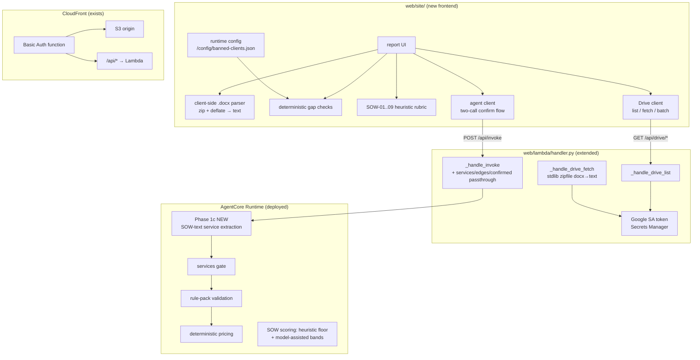

# SOW Gatekeeper POC — build plan

A drag-and-drop SOW validation page hosted on the existing web layer (CloudFront + S3 + Lambda,
Basic Auth), integrated with the deployed AgentCore agent for full reviews, and with a Google
Drive folder (backend service account) as a document source. Built incrementally in milestones,
reusing the deterministic core and web plumbing that already exist in this repo.

## Architecture

## Confidentiality rule

The brand/contamination word list used by the checks is customer-confidential. It is **never
committed**: the page fetches `/config/banned-clients.json` at runtime (same origin, behind the
site's auth), uploaded out-of-band from the gitignored `web/site-private/` directory. The page
ships with a placeholder fallback only, and shows a badge indicating whether the real list loaded.

## Milestones

- **M0 — Knowledge graph** (done): `.understand-anything/knowledge-graph.json` — 202 nodes,
  314 edges, 9 layers — generated so build agents can navigate the codebase quickly.
- **M1 — Frontend + hosting**: `web/site/gatekeeper.html` (this commit) served by the existing
  default S3 behavior behind Basic Auth; CDK `BucketDeployment` with `prune: false` (never
  delete live `share/*.json`, `config/`, or hand-uploaded pages); runtime config fetch.
- **M2 — Agent full review**: `main.py` Phase 1c — extract services from `sow_text` when none
  supplied (honoring `REQUIRE_EXTRACTION_CONFIRMATION`, returning `awaiting_confirmation` with
  the extraction for user confirmation); `handler.py` passthrough of
  `services`/`edges`/`extraction_confirmed`; two-call UI flow rendering
  verdict/findings/cost/SOW criteria/recommendations + share link.
- **M3 — Google Drive source**: service-account key in Secrets Manager, `DRIVE_FOLDER_ID` env;
  `GET /api/drive/list` + `GET /api/drive/fetch?id=` with server-side stdlib .docx→text
  extraction (no compiled wheels — the Lambda bundles via host pip); batch "validate all"
  summary in the UI.
- **M4 — Hardening**: full E2E checklist, secret/name scan gate before any push, docs.

## Verification per milestone

Curl checks (401 without auth / 200 with; config JSON served; two-call agent sequence on
`data/samples/sample-sow-strong.md` → `awaiting_confirmation` → `complete` with cost + sow score
+ share link), plus browser acceptance: drag a real .docx → local report; agent review; Drive
panel lists and batch-validates the shared folder.
